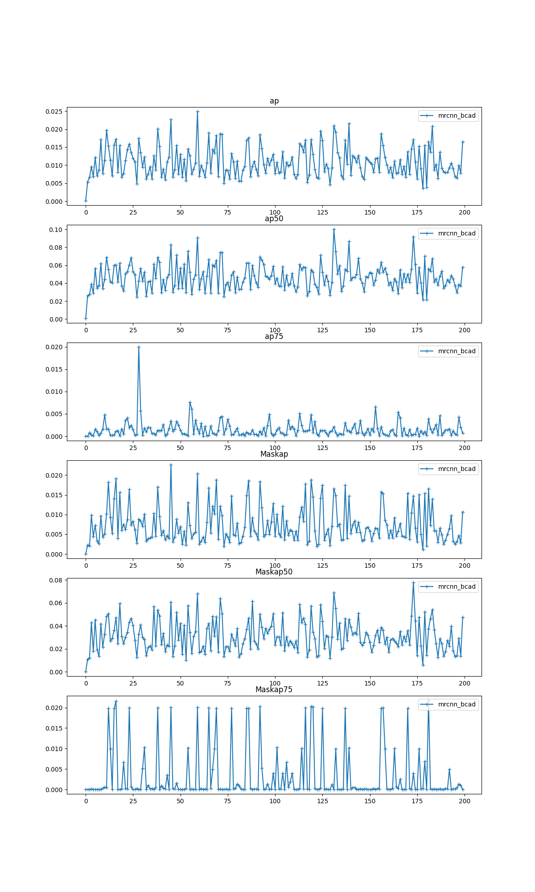
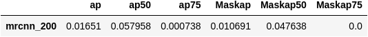
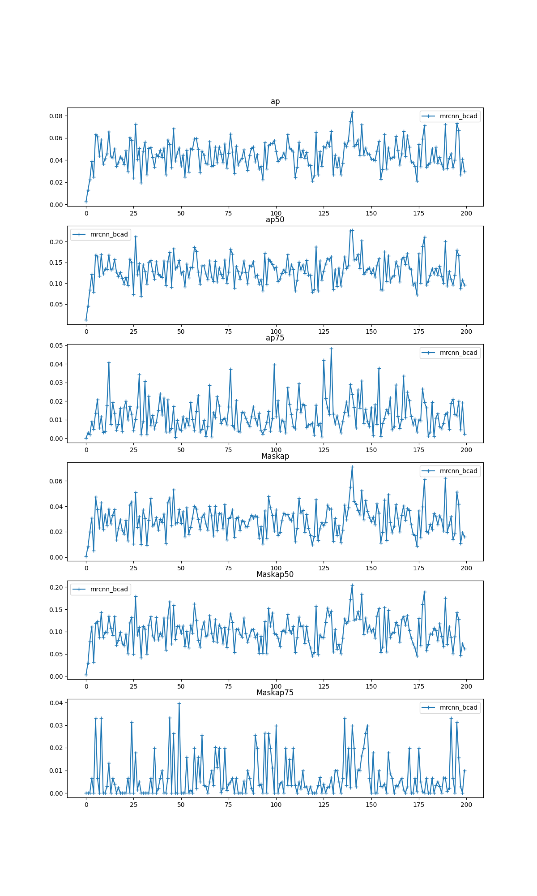
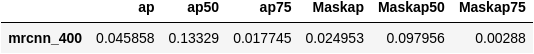
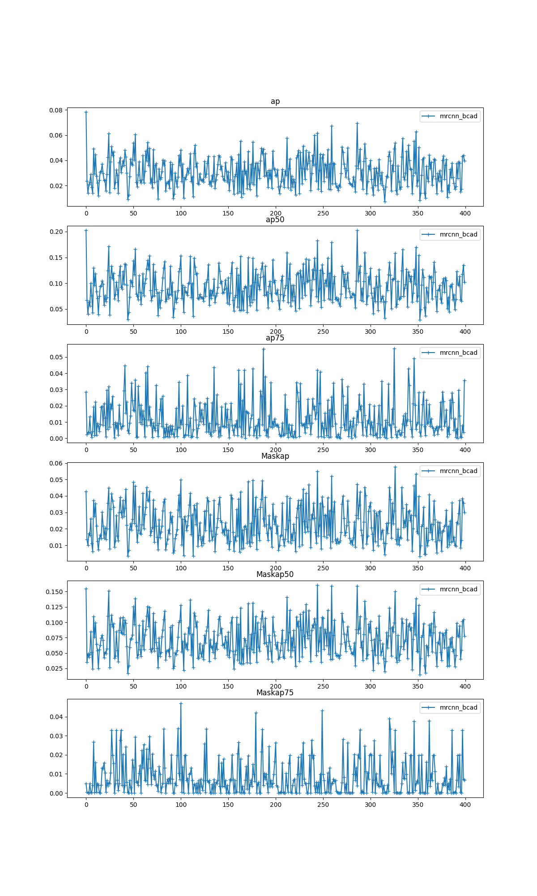
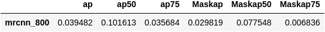
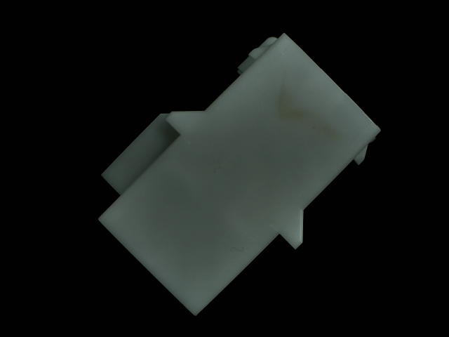

## Note 

- main_mrcnn (mrcnn)
- main_alb (mrcnn with cp)
    - evaluator error: IndexError: list index out of range  
evaluator results are not saved

## dataset

<span style="color: red"> __To be published soon__ </span> ⏳

Burned Connector Anomaly Detection Dataset  

Available Tasks: object detection, instance segmentation   
Format: [COCO](https://cocodataset.org/#home) format

## data info 
(TBU)

## USAGE

(TBU) 
```bash
```

## Experimental results 

|Model type   | Desc  |
|---|---|
|mrcnn_{num}   | ...  |
|mrcnn_cp_{num}   | Mask RCNN w/ Copy-paste aug. that starts from mrcnn_800.pth  |
|mrcnn_cp_v4_400 | Mask RCNN w/ Copy-paste aug. that starts from mrcnn_cp_400.pth  |

|<b>Mask RCNN (0~200 epoch)</b> |
| :--: |
| |
|<b>last epoch value</b> |
| |


|<b>Mask RCNN (200~400 epoch)</b> |
| :--: |
| |
|<b>last epoch value</b> |
| |


|<b>Mask RCNN (200~400 epoch)</b> |
| :--: |
| |
|<b>last epoch value</b> |
| |


## sample preview

from v1 dataset
  
from v2 dataset
  
  

## model weights

saved path: /volume1/NFS/epsilon/model_weights/bcad (in MSIS LAB NAS)
---

## Acknowledge

in [MSIS Lab](https://www.cbnu.msislab.com/).


## Contact 

person in charge: epsilon ahn<sup>1</sup>  
email: ypahn@chungbuk.ac.kr   
<sup>1</sup>: Department of Computer Science, Chungbuk National University, Cheongju 28644, South Korea  


